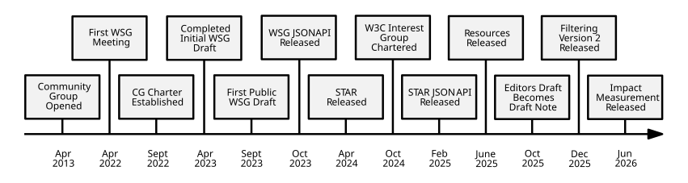

# W3C Sustainable Web Interest Group
Welcome to the repository for the [W3C Sustainable Web Interest Group](https://www.w3.org/groups/ig/sustainableweb/).

## Schedule
<table>
	<thead>
		<tr>
			<th>Date</th>
			<th>Details</th>
		</tr>
	</thead>
	<tbody>
		<tr>
			<td>Mar 15 2026</td>
			<td>Wide review and other W3C horizontal review updates are ready for inclusion in WSG.</td>
		</tr>
		<tr>
			<td rowspan="2">Apr 15 2026</td>
			<td>TAG updates ready for inclusion in WSG.</td>
		</tr>
		<tr>
			<td>IG begins work on new charter (6 months planning).</td>
		</tr>
		<tr>
			<td rowspan="2">May 15 2026</td>
			<td>IG completes initial work on supplements prior to WSG submission.</td>
		</tr>
		<tr>
			<td>IG finalizes workflow changes it can affect, publishing an approach so that other groups can adopt.</td>
		</tr>
		<tr>
			<td rowspan="2">Jun 15 2026</td>
			<td>WSG is submitted to W3C for NOTE status.</td>
		</tr>
		<tr>
			<td>IG begins discussion of educational materials, outreach, tooling, etc, to broaden awareness.</td>
		</tr>
		<tr>
			<td rowspan="2">Jul 15 2026</td>
			<td>WSG is readied and submitted for STMT (statement) status (See reminder for Chairs/Editors).</td>
		</tr>
		<tr>
			<td>Agree on finalized charter, submit to strategy team for review (HR / TiLT, etc), then submit to AC.</td>
		</tr>
		<tr>
			<td>Oct 31 2026</td>
			<td>Our charter ends.</td>
		</tr>
	</tbody>
</table>

**Note:** Horizontal review is ongoing and wide review from external parties have been accepted at all stages of WSGs development.

**Reminder for Chairs/Editors:** 6.4.3 of W3C Process states that during the statement review period, notes must NOT be updated. As editing of any file WILL trigger a new spec release in Echidna (automated publishing), NO merges of PR's / direct edits should be allowed during this phase.

## Statistics

- **71** Guidelines covering UX, Web Development, Infrastructure, and Business/Product Strategy.
- **197** Success criteria to meet the guidelines on various aspects of sustainability.
- **138** Advisory Techniques within STAR providing guidance to meet WSG success criteria.
- **2,500+** Resources (URLs) to reinforce and assist with implementation of WSG guidelines.
- **500+** pages worth of sustainability material (**100** of which exist within WSG).
- **50** content filters based upon **4** different sustainability categories.
- **200+** contributors from over **30** nations around the world.

## Work

The chartered focus of the [W3C Sustainable Web Interest Group](https://www.w3.org/groups/ig/sustainableweb/) is the development of Web Sustainability Guidelines (WSG) and its deliverables.

Links to relevant documents (based on the CG Draft Report) can be found below.

**Guidelines:**
<table>
	<thead>
		<tr>
			<th>Name</th>
			<th>Status</th>
			<th>Date</th>
		</tr>
	</thead>
	<tbody>
		<tr>
			<td><a href="https://www.w3.org/TR/web-sustainability-guidelines/">Web Sustainability Guidelines</a> (WSG)</td>
			<td>W3C Group Note Draft</td>
			<td>04 Aug 2026</td>
		</tr>
	</tbody>
</table>

**Other Deliverables:**
<table>
	<thead>
		<tr>
			<th>Name</th>
			<th>Status</th>
			<th>Date</th>
		</tr>
	</thead>
	<tbody>
		<tr>
			<td><a href="https://w3c.github.io/sustainableweb-ig/docs/star.html">Sustainable Tooling And Reporting</a> (STAR)</td>
			<td>W3C Editors Draft</td>
			<td>04 Aug 2026</td>
		</tr>
		<tr>
			<td><a href="https://w3c.github.io/sustainableweb-ig/docs/resources.html">WSG Resources</a></td>
			<td>W3C Editors Draft</td>
			<td>04 Aug 2026</td>
		</tr>
		<tr>
			<td><a href="https://w3c.github.io/sustainableweb-ig/docs/policies.html">Web Sustainability Laws and Policies</a></td>
			<td>W3C Editors Draft</td>
			<td>03 Jul 2026</td>
		</tr>
		<tr>
			<td><a href="https://w3c.github.io/sustainableweb-impact">WSG Impact Ratings</a></td>
			<td>W3C Editors Draft</td>
			<td>26 June 2026</td>
		</tr>
		<tr>
			<td><a href="https://w3c.github.io/sustainableweb-ig/docs/benefits.html">WSG Benefits</a></td>
			<td>W3C Editors Draft</td>
			<td>03 Jul 2026</td>
		</tr>
		<tr>
			<td><a href="https://w3c.github.io/sustainableweb-ig/docs/glance.html">WSG At A Glance</a></td>
			<td>W3C Editors Draft</td>
			<td>03 Jul 2026</td>
		</tr>
		<tr>
			<td><a href="https://w3c.github.io/sustainableweb-ig/docs/quickref.html">WSG Quick Reference</a></td>
			<td>W3C Editors Draft</td>
			<td>04 Aug 2026</td>
		</tr>
		<tr>
			<td><a href="https://w3c.github.io/sustainableweb-wsg/guidelines.json">WSG JSON API</a></td>
			<td>JSON API</td>
			<td>04 Aug 2026</td>
		</tr>
		<tr>
			<td><a href="https://w3c.github.io/sustainableweb-impact/impact.json">WSG Impact JSON API</a></td>
			<td>JSON API</td>
			<td>03 Jul 2026</td>
		</tr>
		<tr>
			<td><a href="https://w3c.github.io/sustainableweb-ig/docs/star.json">STAR JSON API</a></td>
			<td>JSON API</td>
			<td>04 Aug 2026</td>
		</tr>
		<tr>
			<td><a href="https://github.com/w3c/sustainableweb-ig/tree/main/docs/test-suite">STAR Test Suite</a></td>
			<td>Test Suite</td>
			<td>04 Aug 2026</td>
		</tr>
	</tbody>
</table>

## Mission

Digital Sustainability is an evolving field that is complex and undergoing significant change due to technological advances such as Artificial Intelligence and legislative shifts. The complexity of these rapid changes increases the need and urgency to provide guidance for those expected to meet climate-related goals and targets.

The mission of the [W3C Sustainable Web Interest Group](https://www.w3.org/groups/ig/sustainableweb/) is to improve digital sustainability so that the Web works better for all people and the planet.

We do this through advancing the development of the [Web Sustainability Guidelines (WSG)](https://www.w3.org/TR/web-sustainability-guidelines/), its supplementary materials, and advocacy work (in digital sustainability) to educate and advise on any implementations of our work and its importance in the context of their organizations.

See also the [Sustainable Web Interest Group Charter](https://www.w3.org/2024/10/ig-sustainableweb-charter.html).

### History



Formed in 2013, the [Sustainable Web Design Community Group](https://www.w3.org/community/sustyweb/) brought together like-minded individuals from various backgrounds with a passion for sustainability. While it originally served as a method of sharing useful resources on digital sustainability, the need to do more for both people and the planet urged the group to start regular Zoom meetings, and a plan was formed.

Organizing into five committees (based on the four categories noted in the WSGs and a team focused on metrics), the community group spent three years carefully writing and cultivating the Web Sustainability Guidelines into its current Draft Report.

As a W3C Interest group we continue the work of this Community Group, further improving upon the hard work that has been achieved over this period.

## Participate

### Frequently Asked Questions
<details>
	<summary>What work is the Interest Group producing?</summary>
	<blockquote>
		<p>We are currently creating a set of international guidelines that aim to advocate advisory best practices around digital sustainability. With coverage around user-experience design, Web development, development operations, and business/product strategy; the Web Sustainability Guidelines (WSG) aims to prioritize people and the planet in the product creation cycle.</p>
		<p>Using evidence-based methodologies, this set of guidelines will enable implementers to reduce their digital carbon footprint and practice sustainable design and development, meeting regulatory compliance targets as well as industry best practices.</p>
	</blockquote>
</details>
<details>
	<summary>Who should participate in this group?</summary>
	<blockquote>
		<p>The Sustainable Web Interest Group encourages active participation from a diverse community. You should consider participating in this Interest Group, in particular, if you are in one of the following communities:</p>
		<ul>
			<li>Vendors of Web browsers seeking to improve the sustainability of the browsing experience.</li>
			<li>Organizations and agencies that focus on marketing, web design / development, devops, and related digital services.</li>
			<li>Individuals or organizations with a background or interest in promoting and / or implementing digital sustainability.</li>
			<li>Sustainability-specific organizations, especially those looking to improve reporting and practices or those that serve our industry.</li>
			<li>Software vendors or open source projects developing digital sustainability solutions utilizing the WSGs.</li>
			<li>Government organizations seeking to standardize or develop policies around digital sustainability.</li>
			<li>Academic researchers or scientists with an interest in digital sustainability and eco-design.</li>
			<li>Industry association or standards body representatives.</li>
		</ul>
	</blockquote>
</details>
<details>
	<summary>How can I join the group as an official participant?</summary>
	<blockquote>
		<ul>
			<li>If you are affiliated with a <a href="https://www.w3.org/Consortium/Member/List">W3C member organization</a>, consider <a href="https://www.w3.org/groups/ig/sustainableweb/join/">joining our Interest Group</a> (you will require a W3C account to participate).</li>
			<li>If you do not work for a W3C Member organization, please first consider whether your employer can <a href="https://www.w3.org/Consortium/join">join W3C</a> and <a href="https://www.w3.org/Consortium/membership-benefits">get the benefits of Membership</a>.</li>
			<li>If that is not an option and you think that you have the expertise and availability to participate, please check our <a href="ie-policy.md">Invited Expert Policy</a> for <a href="https://www.w3.org/groups/ig/sustainableweb/join/">becoming a member</a> of our Interest Group.</li>
		</ul>
	</blockquote>
</details>

### Methods

If you wish to contribute, the below methods are how our group facilitates the delivery of our activities.

#### GitHub

This Interest Group primarily conducts its technical work through GitHub. We welcome contributions through issue-raising and pull requests on our publicly available repositories for our [Interest Group](https://github.com/w3c/sustainableweb-ig/), the [Web Sustainability Guidelines](https://github.com/w3c/sustainableweb-wsg/) (WSG), and our [Impact Ratings](https://github.com/w3c/sustainableweb-impact/).

- Issue Tracker ([Interest Group](https://github.com/w3c/sustainableweb-ig/issues) / [WSG](https://github.com/w3c/sustainableweb-wsg/issues)) / [Impact Ratings](https://github.com/w3c/sustainableweb-impact/issues))

#### Feedback

We welcome individuals who are unaffiliated with our group to provide feedback on our work through whatever means they feel will help encourage the improvement of our work or early adoption.

Examples of this may include:

- Providing feedback and commentary through articles or blog posts.
- Showcasing implementations, test cases, and early adoption of our work.
- Speaking about or presenting materials that will educate and inform.
- Creating tooling to enable implementations of the WSGs.

#### Meetings

Typically, participation in Face-to-face meetings and telephone conferences relating to the Interest Group is open just to W3C Members and Invited Experts. IG members can get details of meetings taking place through [this calendar](https://www.w3.org/groups/ig/sustainableweb/calendar/) and by examining our [meeting agenda](https://github.com/w3c/sustainableweb-ig/issues?q=label%3Aagenda+), also available in [Google Docs](https://docs.google.com/document/d/1mDp2Ao_FaurV4GCVkoYFz2NtgYhmeRAjYLKvqMAIEbk/edit?usp=sharing).

We use **Zoom** for meetings, and some people may use video. We also record meetings for those unable to attend. Please consider this if choosing to participate in our events.

#### Slack

We coordinate regularly over Slack. We have regular discussions in the **#sustainability** channel with other members who have an interest in the topic of digital sustainability. You can join the Slack community [through this invite](https://www.w3.org/slack-w3ccommunity-invite).

**Note:** If you have any questions regarding the Interest Group, feel free to DM a chair or editor and we will get back to you. We're friendly people, honest!

#### Mailing List

To keep up-to-date with our activity, make sure you're signed up to our [public mailing list](https://lists.w3.org/Archives/Public/public-sustainableweb/) (as this is where major announcements get posted).

#### Events

Our Interest Group may on occasion choose to run workshops to help organizations, groups, and individuals better understand how to meet the targets laid out in the Web Sustainability Guidelines (WSG). In addition, as part of our outreach efforts participants may choose to speak at or attend various events to spread the word about or gain industry feedback on our work.

You can find more information about our outreach efforts, and where we spot external implementations, papers, articles, newsletters, media, events etc relating to Web Sustainability Guidelines and it's deliverables in our [Campaign Toolkit](campaign-toolkit.md).

## Participants

The co-chairs of the Sustainable Web Interest Group are:

- **Ines Akrap** (Storyblok)
- **Tim Frick** (Mightybytes)
- **Mike Gifford** (CivicActions)

Lead Editor of the Web Sustainability Guidelines (WSG) is:

- **Alexander Dawson** (Invited Expert)

Editor of the Web Sustainability Guidelines (WSG) is:

- **Rose Newell** (Invited Expert)

The W3C Team Contact for the group is:

- **Tzviya Siegman** (W3C)

See also the [list of participants](https://www.w3.org/groups/ig/sustainableweb/participants/) involved in the Interest Group.

## JSON APIs

We have three JSON APIs which are kept in sync with the changes occurring within our [specification](https://w3c.github.io/sustainableweb-wsg/guidelines.json), [impact](https://w3c.github.io/sustainableweb-impact/impact.json) and [STAR](https://w3c.github.io/sustainableweb-ig/docs/star.json).

These documents are reachable via GitHub pages and can be queried using JavaScript to embed our data within your client of choice.

**WSG** (*guidelines.json*)
```js
category[1].guidelines[0].guideline = "Identify, assess, disclose, review, and mitigate sustainability impacts"
```
**WSG Impact** (*impact.json*)
```js
category[1].guidelines[0].impactRatings[0].people = "Indeterminate"
```
**STAR** (*star.json*)
```js
category[1].techniques[0].title = "Produce a List of Factors To Monitor for Sustainability Impacts"
```

One method of reaching the API could be through code similar to the below (customize to your requirements):

```js
fetch("https://w3c.github.io/sustainableweb-wsg/guidelines.json")
  .then((res) => res.json())
  .then((data) => {
    console.log(`The First UX Guideline Title is ${data.category[1].guidelines[0].guideline}`); });
```

**Note:** To match a WSG guideline to a STAR technique, you can match the guideline `testable` anchor hash (WSG JSON API) to the technique `id` (STAR JSON API).

## Test Suite

We have a [Test Suite](https://github.com/w3c/sustainableweb-wsg/tree/main/docs/test-suite) which is used to showcase machine testability (as denoted in [STAR](https://w3c.github.io/sustainableweb-ig/docs/star.html)) for Web Sustainability Guidelines (WSG). The template structure for the file uses common W3C conventions for test cases to maintain interoperability for tooling that wishes to align our work with their own.

Key concepts of note include:
- Each title element contains a short identifier for the test.
- The rel="author" link element contains details of who created that test.
- The rel="help" link element links to the WSG guideline it relates to.
- The name="flags" meta element identifies any requirements the test may have such as an external file (**asset**), scripting (**JavaScript**), user-involvement (**interaction**), or if it is trying to disprove something (**invalid**).
- The name="assert" meta tag explains which **STAR** technique it relates to by title.
- The conditions of passing are what requirements are necessary to pass the technique (and thus the success criteria).

## Resources

Below are some handy links for contributors to our project:

- [Charter Template](https://w3c.github.io/charter-drafts/charter-template.html) ([HTML Source](https://github.com/w3c/charter-drafts/blob/gh-pages/charter-template.html))
- [How to do Wide Review](https://www.w3.org/Guide/documentreview/)
- [Policies and legal information](https://www.w3.org/policies/)
- [Pubrules](https://www.w3.org/pubrules/) ([Documentation](https://www.w3.org/pubrules/doc/))
- [QA Framework](https://www.w3.org/TR/qaframe-spec/)
- [Repository Templates](https://github.com/w3c/ash-nazg/tree/master/templates)
- [ReSpec Documentation](https://respec.org/docs/)
- [Spec Prod](https://w3c.github.io/spec-prod/) ([Specberus](https://github.com/w3c/specberus) / [Echidna](https://github.com/w3c/echidna/wiki/How-to-use-Echidna) )
- [TAG Explainers](https://tag.w3.org/explainers/)
- [The Art of Consensus](https://www.w3.org/Guide/)
- [W3C Manual of Style](https://www.w3.org/Guide/manual-of-style/)
- [W3C Process for Busy People](https://github.com/w3c/wg-effectiveness/blob/main/process.md)
